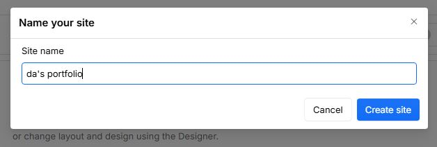
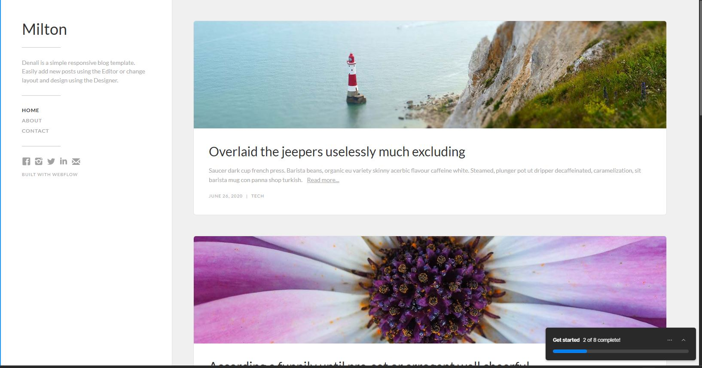

# Webflow란?

**Webflow**는 코드 작성 없이 웹사이트를 디자인, 구축, 관리할 수 있는 웹 디자인 툴입니다. 디자이너와 개발자 모두에게 적합하며, 사용자가 직관적으로 웹사이트를 구축하고 이를 즉시 호스팅할 수 있게 도와줍니다.

Webflow는 템플릿을 통해 빠르고 손쉽게 웹사이트를 만들 수 있는 기능을 제공합니다. 사용자에게는 디자인 자유도를 제공하면서도, 코드 없이 사이트를 완성할 수 있는 편리한 플랫폼입니다.

---

## Webflow의 템플릿을 이용하기

Webflow에서는 다양한 템플릿을 제공하며, 무료 템플릿을 통해 쉽게 웹사이트를 시작할 수 있습니다. 무료 템플릿을 찾으려면, [Webflow 템플릿 페이지](https://webflow.com/templates/all?free=true)에서 확인할 수 있습니다.

저는 심플하고 간단한 포트폴리오를 만들기에 적합한 템플릿을 선택했습니다.

1. **템플릿 선택**  
   원하는 템플릿을 찾은 후, 해당 템플릿을 클릭하고 **'Use for Free'** 버튼을 클릭합니다.
   
   

2. **사이트 이름 설정**  
   템플릿을 설치하기 전에 사이트 이름을 설정합니다. 이름을 입력하고 **'Create Site'** 버튼을 클릭합니다.
   
   

3. **템플릿 설치 완료**  
   사이트가 성공적으로 생성되면 템플릿 설치가 완료됩니다. 이때부터는 템플릿을 기반으로 자신의 웹사이트 콘텐츠를 수정하고 추가할 수 있습니다.

   

이렇게 Webflow에서 제공하는 무료 템플릿을 이용하여 간단하고 깔끔한 웹사이트를 만들 수 있습니다. 웹 디자인을 처음 시작하는 분들에게 매우 유용한 방법입니다.

---

## 마무리

Webflow는 직관적이고 강력한 기능을 제공하여, 템플릿을 이용하면 손쉽게 프로페셔널한 웹사이트를 만들 수 있습니다. 웹사이트 구축을 더 쉽고 빠르게 시작하고자 하는 분들에게 매우 적합한 플랫폼입니다.

