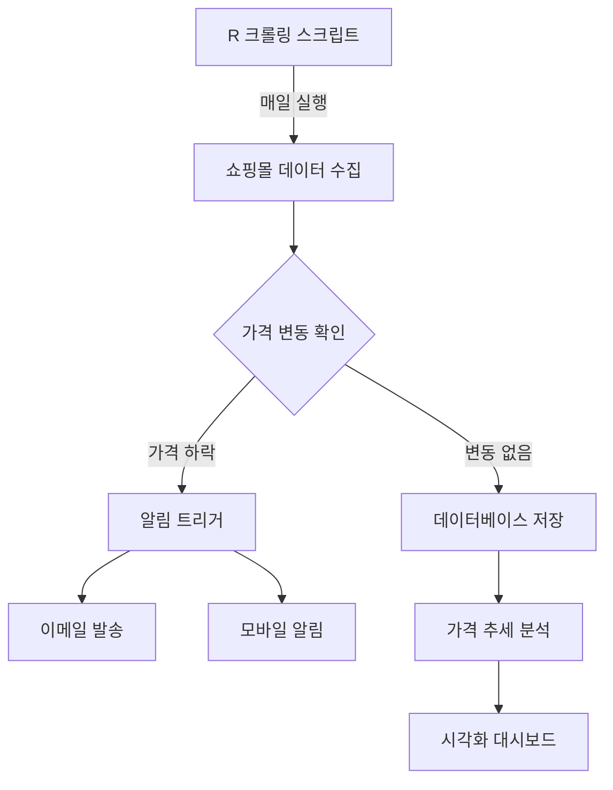

# R을 활용한 웹 크롤링 완전정복: 정적 & 동적 데이터 수집 가이드

웹에는 수많은 데이터가 존재하지만, 이를 효과적으로 수집하고 분석하는 것은 쉽지 않습니다. R 언어는 데이터 분석에 강점이 있을 뿐만 아니라, 다양한 패키지를 통해 웹 크롤링도 효율적으로 수행할 수 있습니다. 이 글에서는 R을 활용한 웹 크롤링의 기초부터 고급 기술까지 초보자도 쉽게 이해할 수 있도록 설명하겠습니다.

## 1. 정적 웹페이지 크롤링: rvest 패키지 활용하기

정적 웹페이지란 서버에서 미리 생성된 HTML을 그대로 전달하는 페이지를 말합니다. 이러한 페이지는 `rvest` 패키지를 사용하여 쉽게 데이터를 추출할 수 있습니다.

### 기본 크롤링 방법

```r
# 필요한 패키지 설치 및 로드
install.packages("rvest")
library(rvest)

# 웹페이지 로드
url <- "https://news.example.com"
webpage <- read_html(url)

# 제목 추출 (CSS 선택자 사용)
titles <- webpage %>% 
  html_nodes("h2.article-title") %>% 
  html_text()

# 링크 추출
links <- webpage %>% 
  html_nodes("a.article-link") %>% 
  html_attr("href")

# 결과 확인
head(data.frame(title = titles, link = links))
```

위 코드는 뉴스 사이트에서 기사 제목과 링크를 수집하는 기본적인 예제입니다. `html_nodes()`는 CSS 선택자나 XPath를 사용하여 원하는 요소를 선택하고, `html_text()`와 `html_attr()`은 각각 텍스트 내용과 속성값을 추출합니다.

## 2. HTML 테이블 데이터 처리하기

웹사이트에는 표 형태로 정리된 데이터가 많이 있습니다. `html_table()` 함수를 사용하면 HTML 테이블을 R의 데이터프레임으로 쉽게 변환할 수 있습니다.

```r
# 위키백과에서 테이블 가져오기
wiki_url <- "https://en.wikipedia.org/wiki/List_of_countries_by_GDP_(nominal)"
tables <- read_html(wiki_url) %>% 
  html_table(fill = TRUE)

# 관심 있는 테이블 선택 (인덱스는 페이지마다 다를 수 있음)
gdp_table <- tables[[3]]

# dplyr로 데이터 정리
library(dplyr)
gdp_cleaned <- gdp_table %>%
  select(Country, `GDP (millions of US$)`) %>%
  rename(GDP_millions = `GDP (millions of US$)`)

# CSV로 저장
write.csv(gdp_cleaned, "countries_gdp.csv", row.names = FALSE)
```

`html_table()`은 웹페이지의 모든 테이블을 리스트 형태로 가져옵니다. 이후 `dplyr` 패키지를 활용하여 필요한 열만 선택하고 이름을 변경한 후, CSV 파일로 저장했습니다.

## 3. API를 통한 데이터 수집과 JSON 처리

많은 웹서비스는 API(Application Programming Interface)를 통해 데이터를 제공합니다. `httr` 패키지를 사용하여 API 요청을 보내고, `jsonlite` 패키지로 JSON 형식의 응답을 처리할 수 있습니다.

```r
# 필요한 패키지 설치 및 로드
install.packages(c("httr", "jsonlite"))
library(httr)
library(jsonlite)

# API 호출 (예: 공공데이터 포털 API)
api_key <- "your_api_key"
api_url <- paste0("https://api.example.com/data?apiKey=", api_key)

response <- GET(api_url)
content <- content(response, "text", encoding = "UTF-8")
data <- fromJSON(content)

# 데이터 확인
str(data)
```

위 코드에서는 `GET()` 함수로 API에 요청을 보내고, `content()` 함수로 응답 내용을 텍스트로 변환한 후, `fromJSON()` 함수를 사용하여 JSON 데이터를 R의 데이터 구조로 변환했습니다.

## 4. 페이지네이션 및 로그인 처리

대부분의 웹사이트는 데이터를 여러 페이지에 나눠서 제공합니다. 이러한 페이지네이션(pagination)을 처리하여 모든 페이지의 데이터를 수집할 수 있습니다.

### 페이지네이션 처리

```r
# 페이지네이션 처리 예제
library(purrr)

# 1~5 페이지의 데이터 수집
pages <- 1:5
all_articles <- map_df(pages, function(page) {
  # URL 패턴에 페이지 번호 삽입
  page_url <- paste0("https://news.example.com/articles?page=", page)
  
  # 페이지 크롤링
  page_html <- read_html(page_url)
  
  # 데이터 추출
  titles <- page_html %>% html_nodes("h2.title") %>% html_text()
  dates <- page_html %>% html_nodes("span.date") %>% html_text()
  
  # 데이터프레임 반환
  data.frame(title = titles, date = dates, page = page)
})
```

### 로그인 후 데이터 수집

일부 웹사이트는 로그인 후에만 접근할 수 있는 데이터가 있습니다. `httr`의 `POST()` 함수를 사용하여 로그인을 처리할 수 있습니다.

```r
# 로그인 처리
login_url <- "https://example.com/login"
credentials <- list(
  username = "your_username",
  password = "your_password"
)

# 로그인 요청
response <- POST(login_url, body = credentials, encode = "form")

# 쿠키 저장
cookies <- cookies(response)

# 로그인 후 데이터 수집
protected_url <- "https://example.com/protected-data"
protected_page <- GET(protected_url, set_cookies(cookies))

# 데이터 추출
protected_data <- content(protected_page) %>%
  read_html() %>%
  html_nodes("div.data") %>%
  html_text()
```

## 5. 동적 웹페이지 크롤링: RSelenium 활용하기

최근 많은 웹사이트는 JavaScript를 사용하여 동적으로 콘텐츠를 로딩합니다. 이런 경우 `rvest`만으로는 데이터를 가져오기 어려울 수 있습니다. `RSelenium` 패키지는 웹 브라우저를 자동화하여 JavaScript가 실행된 후의 콘텐츠를 크롤링할 수 있게 해줍니다.

```r
# RSelenium 설치 및 로드
install.packages("RSelenium")
library(RSelenium)

# 드라이버 실행
driver <- rsDriver(browser = "firefox", port = 4445L)
remote_driver <- driver$client

# 웹페이지 접속
remote_driver$navigate("https://www.example.com/dynamic-content")

# JavaScript 실행 대기
Sys.sleep(3)  # 3초 대기

# 버튼 클릭하기
load_more_button <- remote_driver$findElement(using = "css", value = "button.load-more")
load_more_button$clickElement()

# 추가 대기
Sys.sleep(2)

# 데이터 추출
page_source <- remote_driver$getPageSource()[[1]]
parsed_html <- read_html(page_source)

# 원하는 데이터 추출
items <- parsed_html %>%
  html_nodes("div.item") %>%
  html_text()

# 브라우저 종료
remote_driver$close()
driver$server$stop()
```

`RSelenium`을 사용하면 실제 브라우저처럼 페이지를 로드하고, 버튼 클릭, 스크롤, 텍스트 입력 등의 동작을 수행할 수 있습니다. 이는 JavaScript로 동적으로 콘텐츠를 로드하는 최신 웹사이트에서 특히 유용합니다.

## 6. 크롤링 자동화 및 데이터 저장

정기적으로 데이터를 수집해야 하는 경우, 크롤링 작업을 자동화하는 것이 효율적입니다. R에서는 `cronR`(Linux/Mac) 또는 `taskscheduleR`(Windows)를 사용하여 스크립트 실행을 예약할 수 있습니다.

### 데이터베이스에 저장하기

```r
# DBI 패키지로 SQLite 데이터베이스 연결
install.packages("DBI")
install.packages("RSQLite")
library(DBI)
library(RSQLite)

# 데이터베이스 연결
con <- dbConnect(SQLite(), "crawling_data.db")

# 크롤링한 데이터 저장
dbWriteTable(con, "news_articles", all_articles, append = TRUE)

# 연결 종료
dbDisconnect(con)
```

### 크롤링 자동화 설정 (Windows)

```r
# taskscheduleR 설치 및 로드
install.packages("taskscheduleR")
library(taskscheduleR)

# R 스크립트 예약 실행 (매일 오전 9시)
taskscheduler_create(
  taskname = "daily_crawling",
  rscript = "C:/path/to/your/crawling_script.R",
  schedule = "DAILY",
  starttime = "09:00"
)
```

## 실전 프로젝트 아이디어

1. **뉴스 모니터링 시스템**:
   - 특정 키워드가 포함된 뉴스 기사를 매일 수집
   - 새로운 기사가 발견되면 이메일 알림 발송

2. **가격 변동 추적기**:
   - 쇼핑몰에서 관심 상품의 가격 변동 추적
   - 가격이 특정 기준 이하로 떨어지면 알림



3. **영화 리뷰 감성 분석**:
   - 영화 리뷰 사이트에서 리뷰 수집
   - 자연어 처리 기법을 활용한 감성 분석

## 최신 트렌드와 활용 방안

웹 크롤링 기술은 계속 발전하고 있으며, 최근에는 다음과 같은 트렌드가 두드러집니다:

### 1. API 우선 접근 방식

많은 웹사이트가 공식 API를 제공하고 있습니다. 가능하다면 직접 크롤링보다 API를 사용하는 것이 더 안정적이고 효율적입니다. R에서는 {httr2} 패키지가 최근 출시되어 API 활용이 더욱 편리해졌습니다.

```r
# httr2 패키지 사용 예
library(httr2)

req <- request("https://api.example.com/data") %>%
  req_headers(Authorization = paste("Bearer", api_key)) %>%
  req_retry(max_tries = 3)

resp <- req %>% req_perform()
data <- resp %>% resp_body_json()
```

### 2. 윤리적 크롤링과 robots.txt 준수

웹사이트의 robots.txt 파일을 확인하고 크롤링 규칙을 준수하는 것이 중요해졌습니다. R에서는 {robotstxt} 패키지로 이를 쉽게 확인할 수 있습니다.

```r
library(robotstxt)

# 크롤링 허용 여부 확인
paths_allowed("https://example.com/page", user_agent = "rbot")
```

### 3. 병렬 처리를 통한 성능 향상

대량의 데이터를 크롤링할 때는 {future} 및 {furrr} 패키지를 활용한 병렬 처리가 효과적입니다.

```r
library(future)
library(furrr)

# 병렬 처리 설정
plan(multisession, workers = 4)

# 병렬 크롤링
urls <- paste0("https://example.com/page/", 1:100)
results <- future_map_dfr(urls, function(url) {
  read_html(url) %>%
    html_nodes("div.content") %>%
    html_text() %>%
    data.frame(text = .)
})
```

### 4. 머신러닝과의 통합

수집한 데이터를 바로 머신러닝 모델에 적용하여 인사이트를 도출하는 파이프라인이 인기를 끌고 있습니다. {tidymodels} 생태계와의 통합이 좋은 예입니다.

```r
# 크롤링한 텍스트 데이터로 감성 분석
library(tidymodels)
library(textrecipes)

# 전처리 레시피 정의
recipe <- recipe(sentiment ~ text, data = reviews_data) %>%
  step_tokenize(text) %>%
  step_stopwords(text) %>%
  step_tfidf(text)

# 모델 학습 및 평가
# (코드 생략)
```

## 결론

R을 활용한 웹 크롤링은 정적 페이지부터 동적 페이지, API 활용까지 다양한 방법으로 수행할 수 있습니다. `rvest`로 기본적인 크롤링을, `httr`과 `jsonlite`로 API 데이터를 처리하고, `RSelenium`으로 동적 웹페이지를 크롤링할 수 있습니다. 또한 크롤링 작업을 자동화하여 정기적으로 데이터를 수집하고 분석할 수 있습니다.

웹 크롤링을 시작할 때는 소규모로 시작하여 점차 확장해 나가는 것이 좋습니다. 또한 웹사이트의 이용약관과 robots.txt를 반드시 확인하여 윤리적인 크롤링을 수행해야 합니다. 이러한 기술을 습득하면 데이터 수집부터 분석까지 자동화된 시스템을 구축할 수 있어, 데이터 기반 의사결정에 큰 도움이 될 것입니다.

추가적인 학습 자료와 실전 예제를 찾는다면 "R Web Scraping" 커뮤니티와 CRAN Task View: Web Technologies and Services를 참고하시기 바랍니다.